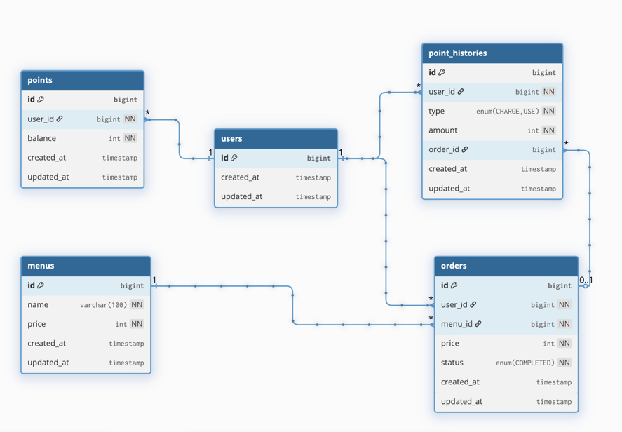

# 커피숍 주문 시스템

## 1. 프로젝트 소개

포인트 기반으로 주문할 수 있는 커피숍 주문 시스템입니다.

사용자는 커피 메뉴를 조회할 수 있고, 포인트를 충전한 뒤 해당 포인트로 메뉴를 주문 할 수 있습니다.
또한 주문 내역은 외부 데이터 수집 플랫폼으로 실시간 전송되는 흐름을 Mock으로 구성했고, 
최근 7일간 주문 데이터를 기준으로 인기 메뉴 Top3를 조회할 수 있습니다.

**기능 구현 자체뿐 아니라**, 이후 확장 가능한 구조와
동시성 / 데이터 일관성 / 조회 성능까지 고려하는 방향으로 설계했습니다.

---

## 2. 요구사항 분석

### 1) 커피 메뉴 목록 조회
- 메뉴 ID, 메뉴명, 가격 정보를 조회할 수 있어야 한다.

### 2) 포인트 충전
- 사용자는 포인트를 충전할 수 있어야 한다.
- 결제 수단은 포인트만 사용 가능하므로, 주문 이전에 포인트 충전 기능이 필요하다.

### 3) 커피 주문 / 결제
- 사용자는 메뉴를 선택해 주문할 수 있어야 한다.
- 주문 시 메뉴 가격만큼 포인트가 차감되어야 한다.
- 주문 완료 내역은 외부 데이터 수집 플랫폼으로 실시간 전송되어야 한다.

### 4) 인기 메뉴 조회
- 최근 7일간 주문 데이터를 기준으로 인기 메뉴 3개를 조회할 수 있어야 한다.
- 메뉴별 주문 횟수 집계는 정확해야 한다.

### 추가 고려사항
- 애플리케이션이 다수 서버 / 다수 인스턴스 환경에서도 문제없이 동작해야 한다.
- 포인트 충전 및 주문 시 동시성 이슈를 고려해야 한다.
- 주문, 결제, 외부 전송 과정에서 데이터 일관성을 고려해야 한다.
- 각 기능과 제약사항에 대한 테스트가 필요하다.

---

## 3. 문제 해결 전략

처음부터 모든 요구사항을 한 번에 구현하지 않고,
기능 단위를 나눠서 순서대로 구현했다.

메뉴 조회, 포인트 충전, 주문 / 결제, 인기 메뉴 조회의 필수 기능을 중심으로 구현했고,
이 과정에서 도메인을 단순하게 유지하면서도 이후 동시성 제어와 데이터 일관성 보완이 가능하도록 구조를 잡았다.

따라서 주문과 포인트 차감은 하나의 흐름으로 관리할 수 있도록 설계했고,
인기 메뉴 집계는 최근 7일간의 주문 완료 데이터를 기준으로 조회하도록 구성했다.

외부 데이터 수집 플랫폼 전송은 우선 **요구사항을 만족하는 Mock 구조**로 구현했다.
이후 Kafka / Outbox / 재시도 / DLT 같은 방식으로 확장할 수 있도록
**OrderEventSender 인터페이스 기반 구조**로 분리했다.

---

## 4. 기술 스택

### Backend
- Java 21
- Spring Boot 4
- Spring Web
- Spring Data JPA
- Spring Validation

### Database
- MySQL
- H2 (Test)

### Query / ORM
- JPA (도메인 상태 변경)
- Querydsl (복잡 조회 / 인기 메뉴 집계)

### Build / Infra
- Gradle
- Lombok

### Test
- JUnit 5
- Spring Boot Test
- MockMvc

---

## 5. 프로젝트 구조

```text
src/main/java/com/popo2381/coffeeshop
├── domain
│   ├── menu
│   │   ├── controller
│   │   ├── dto
│   │   │   └── response
│   │   ├── entity
│   │   ├── repository
│   │   └── service
│   ├── order
│   │   ├── controller
│   │   ├── dto
│   │   │   ├── request
│   │   │   └── response
│   │   ├── entity
│   │   ├── external
│   │   ├── repository
│   │   └── service
│   ├── point
│   │   ├── controller
│   │   ├── dto
│   │   │   ├── request
│   │   │   └── response
│   │   ├── entity
│   │   ├── repository
│   │   └── service
│   └── user
│       ├── entity
│       └── repository
└── global
    ├── common
    └── error
```

### 구조 설계 기준
- **domain 중심 패키지 구조**로 기능 단위 응집도를 높였다.
- **상태 변경은 Service + JPA**, **조회 최적화는 Querydsl**로 역할을 분리했다.
- 외부 전송은 `external` 패키지로 분리해 이후 Kafka 등으로 교체 가능하도록 구성했다.
- 예외 처리는 `global.error`에서 공통 응답 포맷으로 일관되게 처리한다.

---

## 6. API 명세

### 1. 메뉴 목록 조회
- `GET /api/v1/menus`

### 2. 포인트 충전
- `POST /api/v1/points/charge`

### 3. 주문 생성
- `POST /api/v1/orders`

### 4. 주문 단건 조회
- `GET /api/v1/orders/{orderId}`

### 5. 사용자 주문 목록 조회
- `GET /api/v1/orders?userId={userId}`

### 6. 인기 메뉴 조회
- `GET /api/v1/menus/popular`

API 문서: https://oil-baker-29a.notion.site/API-336dbb76310580da8b44e7be2ce21061?source=copy_link

---

## 7. ERD



### 주요 관계
- `User` ↔ `Point` : 사용자별 포인트 잔액 관리
- `User` ↔ `PointHistory` : 포인트 충전 / 사용 이력 관리
- `User` ↔ `Order` : 사용자 주문 이력 관리
- `Menu` ↔ `Order` : 어떤 메뉴가 주문되었는지 관리

---

## 8. 구현 포인트

### 1) 포인트 충전
포인트 충전은 단순 금액 증가가 아니라,
**잔액 상태 변경 + 이력 저장**이 함께 일어나는 흐름으로 설계했다.

#### 처리 흐름
1. 사용자 조회
2. 포인트 조회
3. 충전 금액 검증
4. 포인트 잔액 증가
5. 포인트 충전 이력 저장
6. 응답 반환

---

### 2) 주문 생성
주문 생성은 이 프로젝트에서 가장 중요한 정합성 구간이다.

#### 처리 흐름
1. 사용자 조회
2. 메뉴 조회
3. 포인트 조회
4. 잔액 검증 및 차감
5. 주문 저장
6. 포인트 사용 이력 저장
7. 주문 이벤트 외부 전송(Mock)
8. 응답 반환

#### 설계 포인트
- 주문 생성과 포인트 차감은 **하나의 서비스 흐름**으로 묶었다.
- 포인트 부족, 사용자 없음, 메뉴 없음, 포인트 없음 등의 예외를 분리했다.
- 외부 전송은 현재는 Mock 구현이지만,
  구조상 `OrderEventSender` 구현체만 바꾸면 Kafka 기반으로 확장 가능하다.

---

### 3) 인기 메뉴 조회
인기 메뉴는 **최근 7일 주문 데이터**를 기준으로 집계한다.

#### Querydsl을 사용한 이유
이 기능은 단순 CRUD 조회가 아니기 때문에 아래와 같은 이유로 필요했다.
- 최근 7일 조건 필터링
- 주문 수 집계 (`count`)
- 메뉴별 그룹화 (`group by`)
- 정렬 후 Top3 제한

JPA 기본 메서드보다 **Querydsl**이 명확하고 유지보수가 좋다고 생각했다.

#### 집계 기준
- 최근 7일 이내 주문만 포함
- 메뉴별 주문 건수 집계
- 주문 수 내림차순 정렬
- 상위 3개 메뉴 반환

---

## 9. 동시성 / 데이터 일관성

가장 중요한 정합성 대상은 **사용자의 포인트 잔액**과 **주문 데이터**이다.

포인트는 충전과 차감이 모두 발생하는 상태 데이터이고,
동시에 여러 요청이 들어오면 잔액이 잘못 계산될 수 있다.

- 포인트 차감
- 주문 생성
- 포인트 사용 이력 저장

이 세 단계는 **함께 성공하거나 함께 실패해야 하는 하나의 논리 단위**다.
따라서 주문 / 결제 흐름은 트랜잭션 기준으로 묶는 방향으로 설계했다.

### 확장 방향
- 포인트 차감 / 충전에 **비관적 락** 적용
- 다중 인스턴스 환경에서는 **Redis 분산 락** 고려
- 외부 전송은 **Outbox Pattern + Kafka** 구조로 개선 가능
- 실패 재처리 / 중복 방지는 **이벤트 기반 구조**에서 보완 가능

---

## 10. 테스트

### 메뉴
- 메뉴 목록 조회 API 테스트
- 최근 7일 인기 메뉴 Top3 조회 API 테스트

### 포인트
- 포인트 충전 성공 테스트
- 존재하지 않는 사용자 충전 실패 테스트
- 잘못된 충전 금액 요청 실패 테스트

### 주문
- 주문 생성 성공 테스트
- 존재하지 않는 사용자 / 메뉴 주문 실패 테스트
- 포인트 없음 / 잔액 부족 주문 실패 테스트
- 주문 이벤트 전송 호출 검증 테스트
- 주문 단건 조회 성공 / 실패 테스트
- 사용자 주문 목록 조회 테스트

### 테스트 설계 포인트
- 단순히 성공 케이스만 보는 것이 아니라,
  **실패 케이스와 예외 흐름까지 검증**하도록 구성했다.
- Controller 테스트에서는 **MockMvc 기반 API 검증**으로 실제 요청 / 응답 흐름을 확인했다.
- 인기 메뉴 테스트는 최근 7일 조건을 검증하기 위해
  **테스트 데이터의 created_at 시점을 직접 반영**해 검증했다.

---

## 11. 아쉬운 점과 개선 방향

이번 구현은 필수사항을 충족하는 데 초점을 맞췄지만,
실무적으로 보면 다음 보완 여지가 있다.

### 1) 동시성 제어 강화
- 포인트 충전 / 차감에 대한 락 전략 보완 필요

### 2) 외부 전송 안정성 강화
- 현재는 Mock 호출
- 실제 운영이라면 Kafka / Outbox / 재시도 / DLT 구조 필요

### 3) 조회 성능 고도화
- 인기 메뉴 집계는 현재 DB 실시간 조회 기반
- 트래픽 증가 시 Redis 캐시 / ZSET 기반 랭킹 구조로 확장 가능

### 4) 테스트 범위 확장
- 현재는 API 중심 테스트 위주
- 이후 Service 단위 테스트, 동시성 테스트, 통합 시나리오 테스트 추가 가능